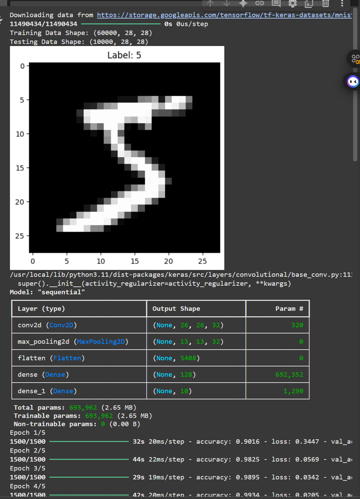
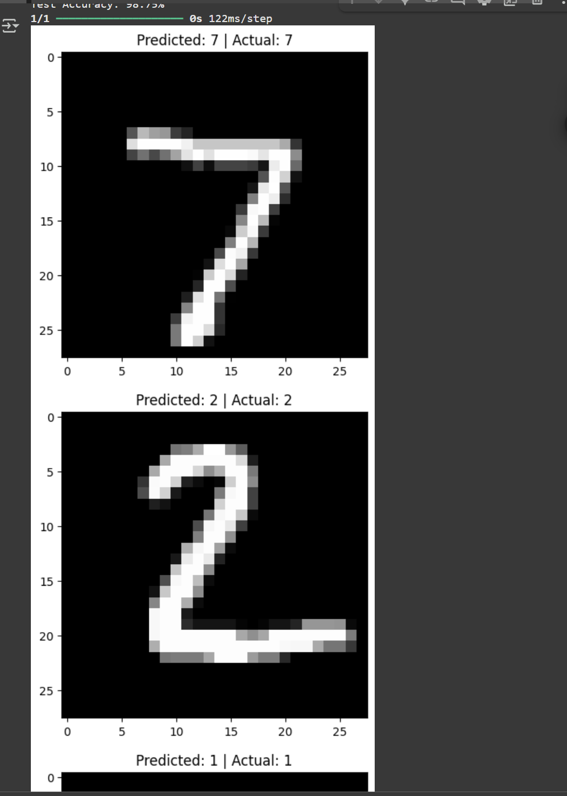

# CodeAlpha Handwritten Character Recognition

✍️ This project is part of my CodeAlpha Machine Learning Internship, where I built a system to recognize handwritten characters using Convolutional Neural Networks (CNNs) and the EMNIST dataset.

---

## 📊 Project Highlights:
- Recognized handwritten alphabets with CNNs
- Trained and evaluated on EMNIST dataset
- Visualized predictions and model performance
- Achieved high accuracy in character classification

---

## 🗂 Dataset:
- **MNIST** Handwritten Digits dataset  
- 60,000 training images and 10,000 testing images  
- Images are grayscale, 28×28 pixels.
  
EMNIST Dataset — downloaded automatically via code during training
from tensorflow.keras.datasets import mnist
(X_train, y_train), (X_test, y_test) = mnist.load_data()

[EMNIST Dataset](https://www.nist.gov/itl/products-and-services/emnist-dataset)

---

## 🧠 Model Architecture
| Layer (type)   | Output Shape  | Parameters |
|---------------|--------------|------------|
| Conv2D        | (26, 26, 32) | 320        |
| MaxPooling2D  | (13, 13, 32) | 0          |
| Flatten       | (5408)       | 0          |
| Dense (128)   | (128)        | 692,352    |
| Dense (10)    | (10)         | 1,290      |

**Total Parameters:** 693,962

---

## 🛠 Technologies:
- Python
- TensorFlow / Keras
- NumPy, Matplotlib, Seaborn

---

📈 Results
Test Accuracy: ~99%

Sample Predictions:
  
  

---

*Project submitted for CodeAlpha Machine Learning Internship*
